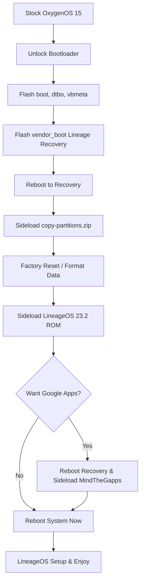

# 📱 OnePlus Nord CE 3 Lite 5G (`larry`) — LineageOS Flashing & Recovery Hub

[](https://wiki.lineageos.org/devices/larry/)
[](#-device-specifications)
[](#-device-specifications)
[-167C80?logo=lineageos&logoColor=white)](https://download.lineageos.org/devices/larry)
[](#-critical-safety-rules--arb-notice)
[](#-disclaimer--license)

Comprehensive, step-by-step documentation and emergency recovery manual for unlocking, flashing, and maintaining **LineageOS** on the **OnePlus Nord CE 3 Lite 5G / OnePlus Nord N30 5G** (codename: `larry`, models: `CPH2467` / `CPH2465`).

---

## 📚 Documentation Index

| Guide | Description | Link |
| :--- | :--- | :--- |
| ⚡ **Flashing Guide** | Complete installation walk-through: bootloader unlock, flashing partition images (`boot`, `dtbo`, `vbmeta`, `vendor_boot`), anti-brick slot sync (`copy-partitions`), ROM sideload, and MindTheGapps setup. | [Read FLASHING_GUIDE.md](./FLASHING_GUIDE.md) |
| 🛡️ **Recovery & Unbrick Guide** | Emergency triage and restoration manual: Fastboot stock image flashing, FastbootD logical partition restoration, payload extraction, EDL 9008 Qualcomm unbrick, and safe bootloader relocking. | [Read RECOVERY_GUIDE.md](./RECOVERY_GUIDE.md) |

---

## 🔍 Device Specifications & Compatibility

| Attribute | Specification |
| :--- | :--- |
| **Device Name** | OnePlus Nord CE 3 Lite 5G / OnePlus Nord N30 5G |
| **Device Codename** | `larry` |
| **Supported Models** | `CPH2467` (India) / `CPH2465` (Global / EU) / `CPH2513` (Nord N30 5G US) |
| **SoC / Chipset** | Qualcomm SM6375 Snapdragon 695 5G (6 nm) |
| **Architecture** | ARM64 (`arm64-v8a`) |
| **Partition Scheme** | Seamless A/B (Virtual A/B with Dynamic Partitions) |
| **Recovery Location** | `vendor_boot` partition (not standard recovery) |
| **Tested Stock Firmware** | OxygenOS 15 (`CPH2467_15.0.0.1810`) |
| **Target Custom ROM** | Official LineageOS 23.2 nightly |

---

## 🚨 Critical Safety Rules & ARB Notice

> [!CAUTION]
> **HARDWARE ANTI-ROLLBACK (ARB) WARNING (OxygenOS 15 Users):**
> Devices running OxygenOS 15 have hardware ARB Qfuses blown in the bootloader.
> 
> 1. **DO NOT Downgrade to Android 13/14 Rollback Firmware:** Attempting to downgrade via old OnePlus rollback packages will trigger an **instant, unrecoverable hard brick** (Qualcomm EDL 9008 mode).
> 2. **ALWAYS Run `copy-partitions`:** Never skip the slot-syncing step during installation. Inactive slots with mismatched firmware will hard-brick upon A/B slot switching.
> 3. **DO NOT Relock Bootloader on Custom ROMs:** Only relock the bootloader after verifying that 100% stock OxygenOS is booted and operational. Relocking on LineageOS causes a permanent `dm-verity corrupted` bootloop.
> 4. **Match Exact Model Firmware:** Never cross-flash firmware between regional variants (`CPH2467` vs `CPH2513`) to prevent modem/baseband and IMEI corruption.

---

## 🚀 Flashing Process Overview



### Quick Commands Cheatsheet

```bash
# 1. Unlock Bootloader
adb -d reboot bootloader
fastboot flashing unlock

# 2. Flash Required Partitions
fastboot flash boot boot.img
fastboot flash dtbo dtbo.img
fastboot flash vbmeta vbmeta.img
fastboot flash vendor_boot vendor_boot.img

# 3. Sideload Slot-Sync Tool (in Recovery)
adb -d sideload copy-partitions-20220613-signed.zip

# 4. Sideload ROM (in Recovery after Factory Reset)
adb -d sideload lineage-23.2-xxxxxxxx-nightly-larry-signed.zip

# 5. Sideload Optional GApps (before first boot)
adb -d sideload MindTheGapps-16.0.0-arm64-xxxxxx.zip
```

For complete instructions with troubleshooting notes, refer to the **[Installation Guide](./FLASHING_GUIDE.md)**.

---

## 📊 Stock OxygenOS vs. LineageOS Experience

| Category | OxygenOS 15 (Stock) | LineageOS 23.2 | Notes & Recommendations |
| :--- | :--- | :--- | :--- |
| **UI Performance** | Occasional micro-stutters / background throttling | Locked 120Hz, buttery smooth animations | Snapdragon 695 performs significantly better without heavy OEM daemons. |
| **Battery Life** | 5.5 - 6.5 hrs Screen-On-Time | **7.5 - 9.5 hrs Screen-On-Time** | Overnight idle drain drops from ~6-8% down to ~1-2%. |
| **Bloatware & Ads** | Preinstalled apps, Glance lockscreen ads, HeyTap services | **Zero bloatware**, pure clean AOSP / Material You | Fully open-source foundation. |
| **Camera Experience** | Proprietary 108MP stock post-processing | Basic Lineage Aperture Camera | Install **[GCam (Google Camera)](https://www.celsoazevedo.com/files/android/google-camera/)** for superior HDR & night shots. |
| **Charging Speed** | 67W SUPERVOOC animated lockscreen | Fast USB-PD charging (~30–35W+ real-world peak) | Retains fast charging, minus proprietary UI animation. |
| **Updates** | Irregular OEM update schedule | **Weekly automated OTA updates** | Seamless 1-click background updates via built-in updater. |

---

## 🧰 Essential Downloads & Resources

- 📥 **LineageOS Official Builds:** [download.lineageos.org/devices/larry](https://download.lineageos.org/devices/larry)
- 📖 **LineageOS Official Wiki:** [wiki.lineageos.org/devices/larry](https://wiki.lineageos.org/devices/larry/install/variant1)
- 📦 **Copy Partitions Tool:** [mirrorbits.lineageos.org/tools/copy-partitions-20220613-signed.zip](https://mirrorbits.lineageos.org/tools/copy-partitions-20220613-signed.zip)
- 📦 **MindTheGapps Package:** [wiki.lineageos.org/gapps](https://wiki.lineageos.org/gapps) / [GitHub Releases](https://github.com/MindTheGapps/MindTheGapps/releases)
- 📷 **Google Camera (GCam) Hub:** [celsoazevedo.com/files/android/google-camera](https://www.celsoazevedo.com/files/android/google-camera/)
- 🔧 **Payload Dumper Go:** [github.com/ssut/payload-dumper-go](https://github.com/ssut/payload-dumper-go)
- 🆘 **EDL Unbrick Tool (Linux/Win):** [github.com/bkerler/edl](https://github.com/bkerler/edl)

---

## ⚠️ Disclaimer & License

> **DISCLAIMER:** Flashing custom ROMs, unlocking your bootloader, and modifying device partitions void warranties and carry inherent risks. While these guides are rigorously tested on `CPH2467`, you perform these steps at your own risk. The authors and maintainers are not responsible for bricked devices, dead SD cards, or lost data.

Distributed under the [MIT License](https://opensource.org/licenses/MIT) & Creative Commons [CC BY-SA 4.0](https://creativecommons.org/licenses/by-sa/4.0/).
